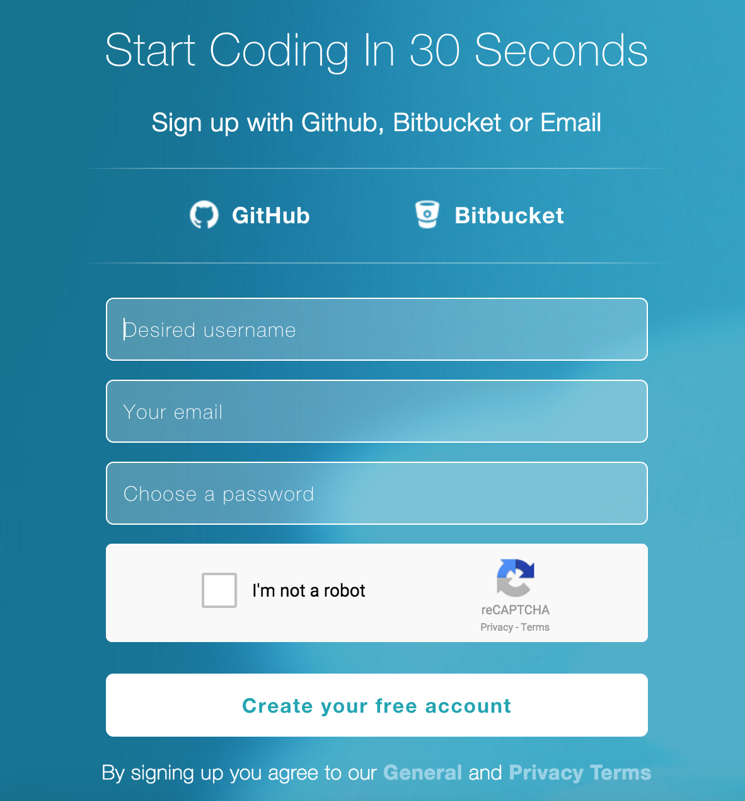
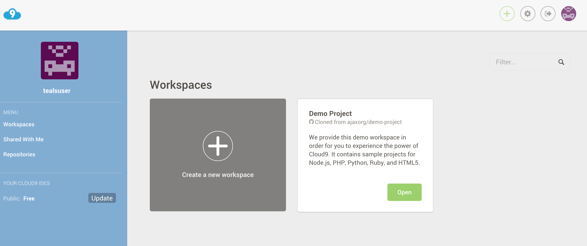
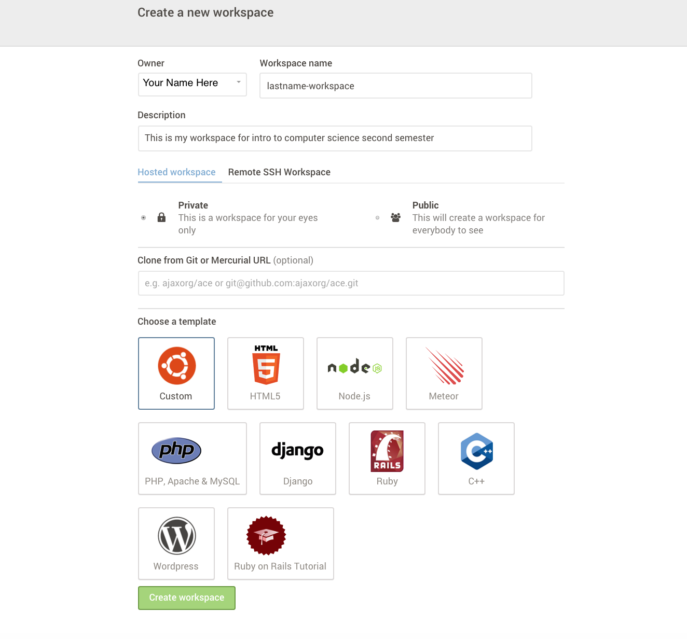

# Python Online Editor Sign Up
We will be using an online IDE [cloud9](https://c9.io) to write python code this semester.  Below are instructions to sign up, name a file, create a new file, and turn in a file. Refer back to this sheet if you are having difficulties. 

## Sign Up Instructions

1. Go to [https://c9.io/web/sign-up/free](https://c9.io/web/sign-up/free)
2. Create account

3. Verify your email address
4. Click the link to go to your dashboard. 
5. Click the plus sign to Create a new workspace. 

6. name your workspace and give workspace a description
7. Make your workspace private
8. Click Create workspace 

9. This will take a few seconds to set you up, but will look like this: 

10. From the top panel select window, pick share (third choice from the top)

11. Enter your teachers' name or email in the "Invite People", this shares your workspace with your teachers and allows them to add comments. 

## Creating a New File
1. Click the plus button to create a new file 

2. Use control-s to save the file. Enter the filename, (following your classes conventions) and press the save button

## Parts of the IDE

* editor
* bash/terminal
* file tree
* rest is okay to ignore for now

## Running Python 
1. In the bottom half of the screen there should be a tab called "bash"
	1. If there is not a tab called "bash", click the plus button and choose "new terminal"
	
Should look like this

2. To run interactive shell: type `python3` into the prompt
 
3. To run a file: type `python3 [filename]`, but instead of `[filename]` use the name of the file you are trying to run
